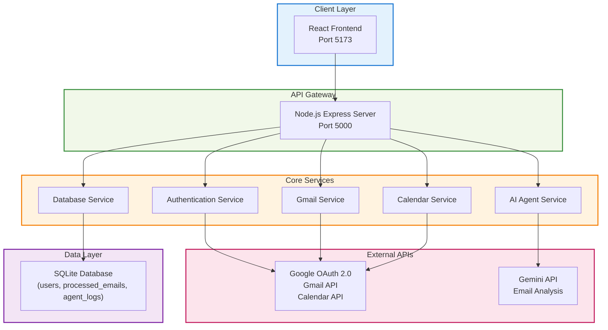
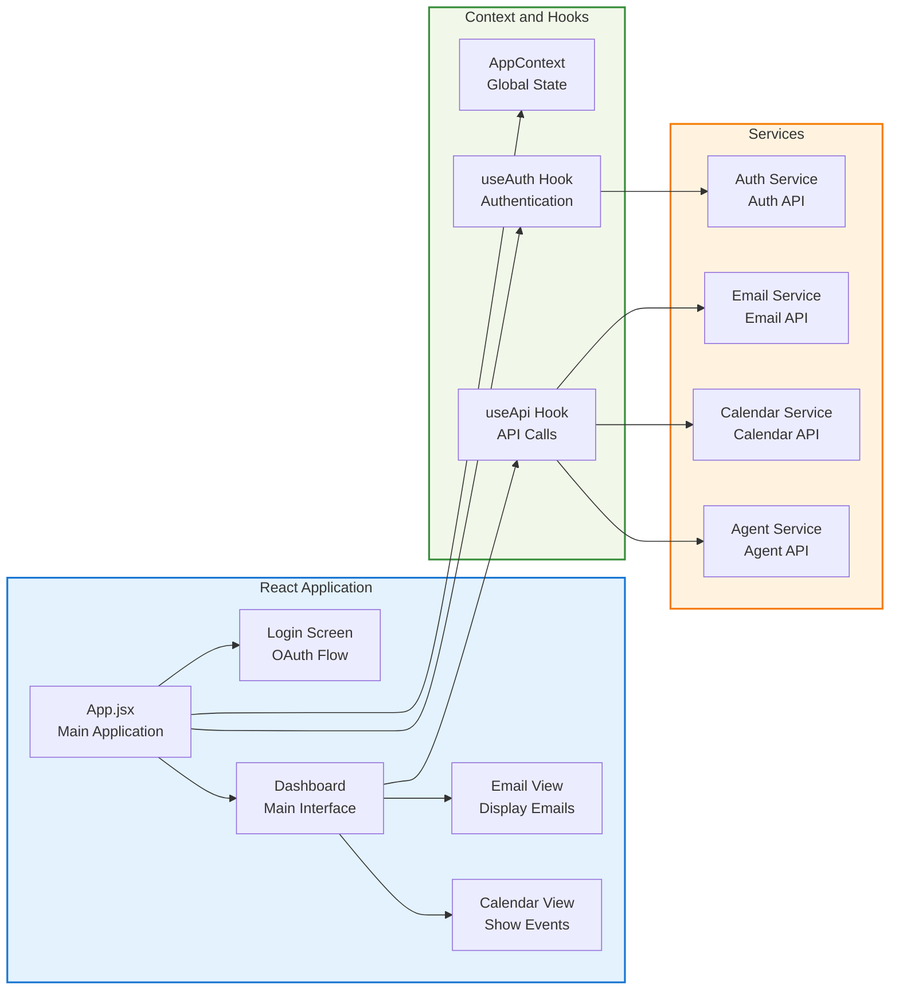
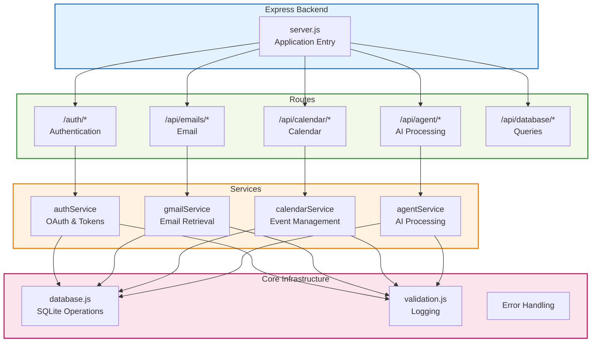
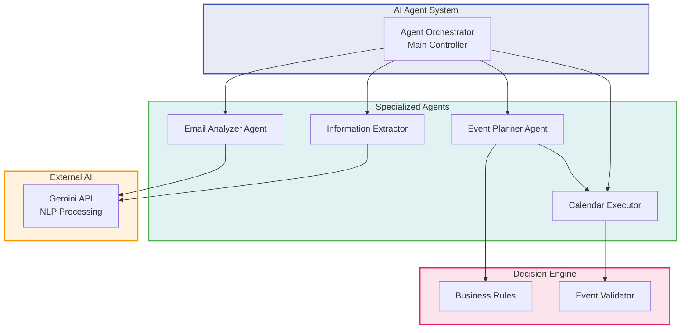
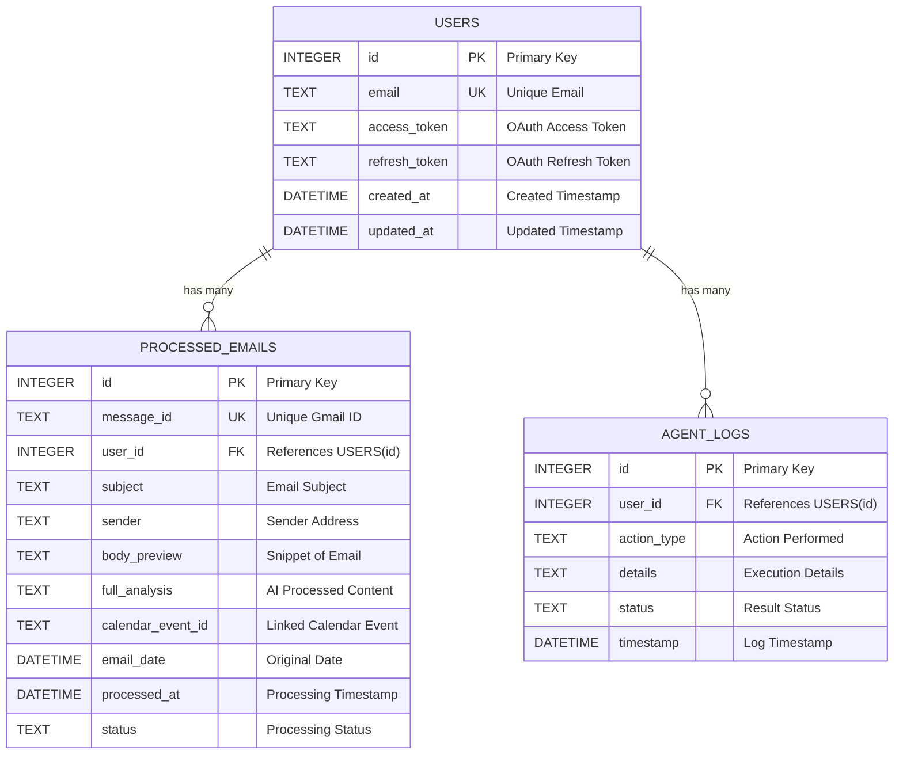
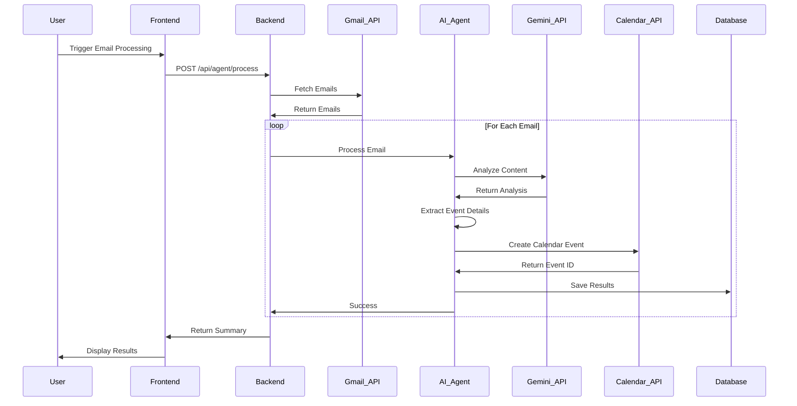
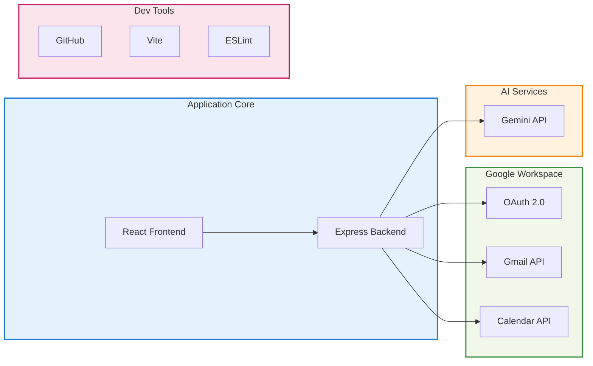
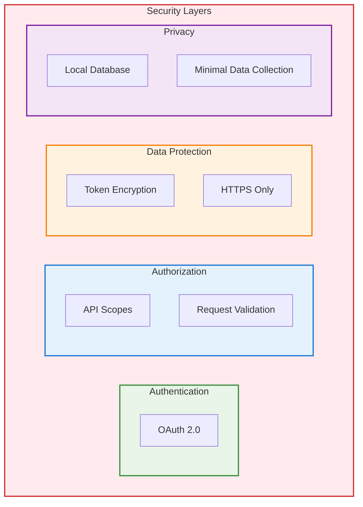

# System Design Document
**Mail → Calendar AI Agent**  
**Name:** Aditya Rehpade  
**College:** Indian Institute of Technology Bhilai

**Personal Email:** adityarehpade1@gmail.com  
**Institute Email:** adityapr@iitbhilai.ac.in  
**GitHub:** https://github.com/BitWiseNexus

---

## Table of Contents
1. [Executive Summary](#executive-summary)  
2. [Architecture Overview](#architecture-overview)  
   - [System Architecture (diagram)](#system-architecture)  
   - [Component Breakdown — Frontend (diagram)](#component-breakdown-frontend)  
   - [Backend Architecture (diagram)](#backend-architecture)  
   - [AI Agent Architecture (diagram)](#ai-agent-architecture)  
3. [Data Design](#data-design)  
   - [Database Schema (ER diagram)](#database-schema)  
   - [Data Flow Architecture (sequence diagram)](#data-flow-architecture)  
4. [Technology Stack](#technology-stack)  
5. [Integration & Security](#integration--security)  
6. [Performance & Quality Assurance](#performance--quality-assurance)  
7. [Conclusion, Repository & LLM Logs](#conclusion-repository--llm-logs)  
8. [Appendices](#appendices)

---

## Executive Summary

This project implements an intelligent **Mail → Calendar AI Agent** that converts important emails into calendar events automatically. The system analyzes email content, extracts dates/deadlines, rates importance, and creates Google Calendar events when appropriate. The stack uses React (frontend), Node.js + Express (backend), Gemini (LLM), and Google APIs (Gmail, Calendar).

---

## Architecture Overview

### System Architecture

### Component Breakdown — Frontend

### Backend Architecture

### AI Agent Architecture

## Data Design

### Database Schema

### Data Flow Architecture

## Technology Stack

### Selected Technologies
- **Frontend:** React 18, Vite, Tailwind CSS, Lucide React, Context API
- **Backend:** Node.js, Express.js, SQLite (single-user)
- **LLM:** Gemini via API
- **Integrations:** Google APIs — Gmail (read), Calendar (write)

### Why these technologies
- Fast developer experience and modern UI stack (React + Vite + Tailwind).
- Gemini is available for development and provides strong NLP capabilities.
- SQLite is lightweight for a single-user prototype with an easy upgrade path.
- Google APIs provide official, supported access for Gmail and Calendar.

## Integration & Security

### Integration Architecture

### Security Architecture

### Operational & Bonus Features
- **Monitoring UI:** logs dashboard, email processing status, event management.
- **Operational features:** batch processing, error recovery, retry policies.
- **Authentication:** OAuth2 for Google; admin role-based controls possible for future work.

## Performance & Quality Assurance

### Performance Capabilities
- Optimized for single-user usage with a design path to scale to multi-tenant deployment (PostgreSQL).
- Event-driven processing and caching to minimize repeated LLM calls.
- Light-weight architecture to keep latency low for interactive use.

### Quality Measures
- ESLint, structured logging, input validation, and robust error handling.
- Unit and integration tests for parsers and API endpoints; manual tests for OAuth flows and calendar creation.

## Conclusion

### Conclusion
The Mail Calendar AI Agent turns email clutter into scheduled, actionable items using a practical, modern stack. It balances automation and privacy and provides a clear upgrade path for scaling.

## Appendices
### Repository
**GitHub:** https://github.com/BitWiseNexus/SDE_Deliverable_Application

### LLM Interaction Log
- **Log 1:** ChatGPT Share #1 — https://chatgpt.com/share/68ca9371-f9b0-800a-a530-816fd071a68a
- **Log 2:** ChatGPT Share #2 — https://chatgpt.com/share/68ca93ed-f4b4-800a-8a69-fc748e3b3808
- **Log 3:** ChatGPT Share #3 — https://chatgpt.com/share/68ca9408-a1bc-800a-9638-50642cbe8000
- **Log 4:** Claude Share — https://claude.ai/share/11af856f-3bc2-4b09-b7a1-bb3f5d342792
